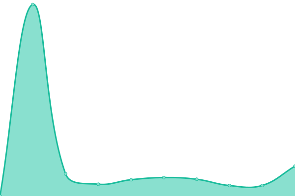
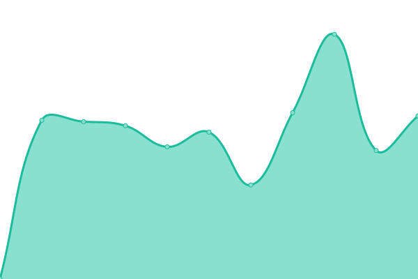

# [📈 Live Status](https://marketlend.github.io/uptime-dashboard): <!--live status--> **🟩 All systems operational**

This repository contains the open-source uptime monitor and status page for Marketlend's websites, powered by [Upptime](https://github.com/upptime/upptime).

<!--start: status pages-->
<!-- This summary is generated by Upptime (https://github.com/upptime/upptime) -->
<!-- Do not edit this manually, your changes will be overwritten -->
<!-- prettier-ignore -->
| URL | Status | History | Response Time | Uptime |
| --- | ------ | ------- | ------------- | ------ |
|  [Marketlend](https://www.marketlend.com.au) | 🟩 Up | [marketlend.yml](https://github.com/marketlend/uptime-dashboard/commits/HEAD/history/marketlend.yml) | 

 1006ms
     
 | 

<a href="https://marketlend.github.io/uptime-dashboard/history/marketlend">100.00%</a>
    

|  [Tyndall Insurance](https://tyndall.insure) | 🟩 Up | [tyndall-insurance.yml](https://github.com/marketlend/uptime-dashboard/commits/HEAD/history/tyndall-insurance.yml) | 

 2219ms
     
 | 

<a href="https://marketlend.github.io/uptime-dashboard/history/tyndall-insurance">100.00%</a>
    

|  [UnLock](https://unlockb2b.com) | 🟩 Up | [un-lock.yml](https://github.com/marketlend/uptime-dashboard/commits/HEAD/history/un-lock.yml) | 

 1776ms
     
 | 

<a href="https://marketlend.github.io/uptime-dashboard/history/un-lock">100.00%</a>
    

|  [UnLock Portal](https://app.unlockb2b.com/buyers/login) | 🟩 Up | [un-lock-portal.yml](https://github.com/marketlend/uptime-dashboard/commits/HEAD/history/un-lock-portal.yml) | 

 743ms
     
 | 

<a href="https://marketlend.github.io/uptime-dashboard/history/un-lock-portal">100.00%</a>
    

|  [UnLock Rewards](https://unlockrewards.com.au) | 🟩 Up | [un-lock-rewards.yml](https://github.com/marketlend/uptime-dashboard/commits/HEAD/history/un-lock-rewards.yml) | 

 1222ms
     
 | 

<a href="https://marketlend.github.io/uptime-dashboard/history/un-lock-rewards">100.00%</a>
    

|  [Eezee Compare](https://www.eezee.compare) | 🟩 Up | [eezee-compare.yml](https://github.com/marketlend/uptime-dashboard/commits/HEAD/history/eezee-compare.yml) | 

 1729ms
     
 | 

<a href="https://marketlend.github.io/uptime-dashboard/history/eezee-compare">100.00%</a>
    

|  [Electricity Compare](http://electricity.compare) | 🟩 Up | [electricity-compare.yml](https://github.com/marketlend/uptime-dashboard/commits/HEAD/history/electricity-compare.yml) | 

 837ms
     
 | 

<a href="https://marketlend.github.io/uptime-dashboard/history/electricity-compare">100.00%</a>
    

|  [Electricity Wizard](https://electricitywizard.com.au) | 🟩 Up | [electricity-wizard.yml](https://github.com/marketlend/uptime-dashboard/commits/HEAD/history/electricity-wizard.yml) | 

 1287ms
     
 | 

<a href="https://marketlend.github.io/uptime-dashboard/history/electricity-wizard">100.00%</a>
    

<!--end: status pages-->
